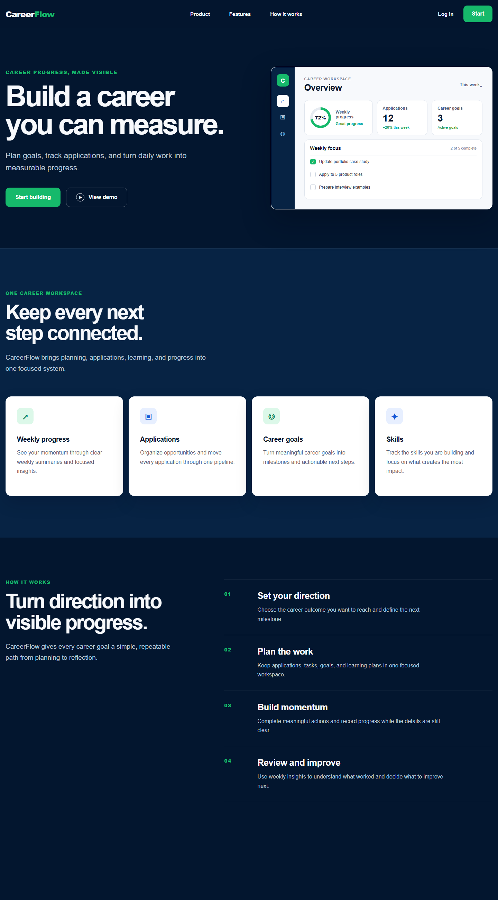

# CareerFlow

CareerFlow is a career management workspace for tracking job applications,
professional goals, tasks, skills, and progress in one place.

## Project status

**Current phase:** “How it works” process section implemented; final landing-page
CTA and footer are next.

The Next.js application is running with strict TypeScript settings, shared design
tokens, and a minimal homepage. Development is split into small, reviewable blocks
so every feature can be understood before the next one is added.

### Implemented

- Product outline and initial landing/dashboard wireframes
- High-fidelity landing-page concept image
- Next.js App Router foundation with React and TypeScript
- Global color tokens and base page styles
- Responsive landing-page header and primary navigation
- Accessible mobile burger menu with keyboard support
- Responsive hero messaging and call-to-action controls
- Responsive dashboard preview with progress and weekly-focus data
- Responsive feature grid generated from structured product data
- Four-step “How it works” process with responsive layout and anchor navigation
- Type checking, production build, and zero known npm vulnerabilities

### Next block

Landing-page final call to action and footer.

### Current implementation

The screenshot below shows the actual Day 6 application state, not the target UI
concept.



## Planned stack

- Next.js and TypeScript
- Tailwind CSS
- PostgreSQL with Prisma
- Authentication
- Automated tests and GitHub Actions

## Documentation

- [Product outline](docs/PRODUCT.md)
- [Initial wireframe](docs/WIREFRAME.md)
- [Project structure](docs/ARCHITECTURE.md)
- [Development workflow](docs/WORKFLOW.md)

## Local development

```bash
npm install
npm run dev
```

Open `http://127.0.0.1:3000` in a browser.

Before completing a development block, run:

```bash
npm run typecheck
npm run build
```
